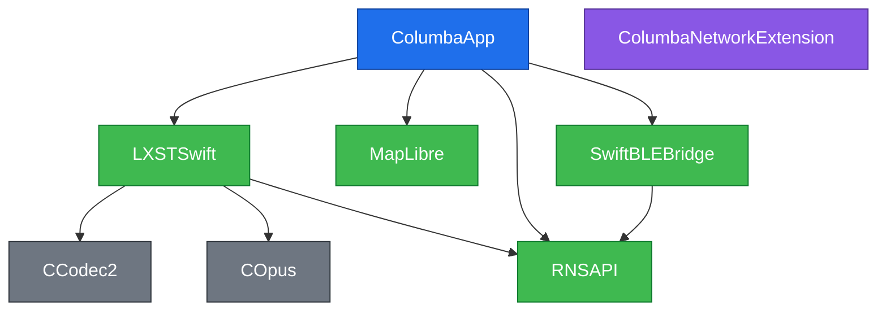

# Columba-iOS Architecture

Target / module dependency graph for the iOS app. Mirrors the role of `docs/architecture.md` in the sibling Android repo (`columba/`).

## Subsystem deep-dives

- [Model B — Background LXMF Delivery](docs/MODEL_B_BACKGROUND_DELIVERY.md) — how the Network Extension delivers LXMF messages + notifications while the app is backgrounded/suspended/locked (no APNS): the NE-canonical node, the control IPC + App-Group frame bridge, the load-bearing invariants, and the on-device-verified inbound/outbound/announce flows.

Regenerate this file from the current `Package.swift` + `Columba.xcodeproj/project.pbxproj`:

```sh
ruby support/generate-module-graph.rb
```

The script reads:
- pbxproj targets (e.g. `ColumbaApp`, `ColumbaNetworkExtension`, `PythonBridge`, `RNSBackendPy`) via the `xcodeproj` Ruby gem (already a dependency for `support/configure-xcodeproj.rb`).
- SPM targets (e.g. `RNSAPI`, `LXSTSwift`, `COpus`, `CCodec2`, `SwiftBLEBridge`) via `swift package dump-package`.

It overwrites the Mermaid block between the start/end marker comments below the `## Target Graph` heading. Do not edit between the markers by hand — changes will be lost on next regen.

## Target Graph

<!-- module-graph-start -->

<!-- module-graph-end -->
