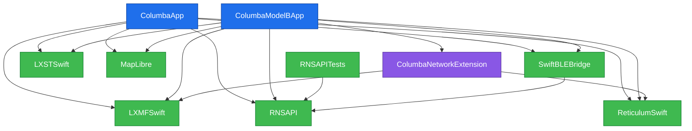

# Columba-iOS Architecture

Columba has one shipping app target and one isolated experimental app target. Flavor selection is a compile-time target boundary; it is not a runtime backend preference or a build-configuration variant.

## App flavors

| Concern | Shipping Python flavor | Experimental Model B flavor |
|---|---|---|
| App target | `ColumbaApp` | `ColumbaModelBApp` |
| Scheme | `Columba` | `Columba-ModelB` |
| Canonical runtime condition | `COLUMBA_RUNTIME_PYTHON` | `COLUMBA_RUNTIME_MODEL_B` |
| Messaging runtime | Embedded Python RNS/LXMF through `PythonRNSBackend` and the Python bridge | `ProxyRnsBackend` controlling a native ReticulumSwift/LXMFSwift node in `ColumbaNetworkExtension` |
| Runtime-owned sources | Python bridge/runtime, Python backend and models, Python network transport | Model B proxy, host lifecycle, App Group IPC/frame seams, BLE/RNode proxy lifecycle, background-delivery UI |
| Runtime-owned packaging | `Python.xcframework`, Python `app/` resources, wheels, standard library, bridging header, install/embed phases | Signed `ColumbaNetworkExtension.appex`; no Python framework, resources, wheels, bridging header, or Python packaging |
| Extension relationship | No target dependency, embed, packet-tunnel entitlement, or Model B lifecycle/UI/proxy behavior | Direct target dependency and signed embed; owns VPN permission, install/start/wait lifecycle, status/settings UI, onboarding gate, and diagnostics |
| Delivery expectation | Internet TCP delivery is foreground/opportunistic; no guaranteed background Internet TCP delivery | Experimental background delivery while the extension is active |

Both apps retain shared product/UI code. `ColumbaModelBApp` links ReticulumSwift directly because it runs the native stack. `ColumbaApp` also has a target-local ReticulumSwift link only because retained public `MessageRepository`/`LXMFSwift` signatures expose ReticulumSwift types; it does not run native Model B.

Each app target must define exactly one canonical runtime condition. `Columba-Swift`, `Debug-Swift`, `Release-Swift`, and the `BackendPreference.modelB` selector are retired. `COLUMBA_BACKEND_SWIFT` remains on Model B as a temporary compatibility condition for transport settings, but it does not select the runtime architecture. Persisted `useSwiftBackend` state has no architectural effect. Debug and Release choose optimization, not runtime flavor.

## Scheme and target graph

- `Columba` builds and runs only the shipping `ColumbaApp`; its test action hosts `ColumbaAppTests`. It has no Network Extension dependency or embed.
- `Columba-ModelB` is the canonical experimental workflow. Its Build action includes `ColumbaModelBApp` and `ColumbaNetworkExtension`, and its Test action includes `ColumbaModelBAppTests`; the app depends on and embeds the signed extension.
- `ColumbaNetworkExtension` owns its target-local ReticulumSwift and LXMFSwift package-product dependencies. Neither dependency object nor its frameworks build file is shared with an app target.
- Building `ColumbaNetworkExtension` separately can be useful for diagnosis, but it is not the canonical Model B build path.

## Project maintenance

`support/isolate-modelb-targets.rb` is the authoritative reconciler for targets, schemes, source/resource/framework ownership, runtime conditions, tests, dependencies, extension embedding, and Python packaging isolation.

- `support/configure-xcodeproj.rb` and `support/add-swift-backend-config.rb` are retired fail-closed entry points.
- `support/embed-ne.rb` delegates to the authoritative reconciler; it never attaches the extension to `ColumbaApp`.
- `support/add-ne-backend-deps.rb` is intentionally narrow and maintains native package products only on `ColumbaNetworkExtension`.

## Subsystem deep-dives

- [Model B — Background LXMF Delivery](docs/MODEL_B_BACKGROUND_DELIVERY.md) — experimental Network Extension topology, IPC, lifecycle, invariants, and historical on-device evidence. Model B is not included in the shipping artifact.

## Generated module graph

Regenerate the Mermaid block from the current `Package.swift` and `Columba.xcodeproj/project.pbxproj` with:

```sh
ruby support/generate-module-graph.rb
```

The script reads Xcode targets and target/package-product dependencies through the `xcodeproj` Ruby gem, plus SPM targets through `swift package dump-package`. It overwrites only the block between the marker comments below. Do not edit that block by hand; changes are lost on regeneration.

## Target Graph

<!-- module-graph-start -->

<!-- module-graph-end -->
